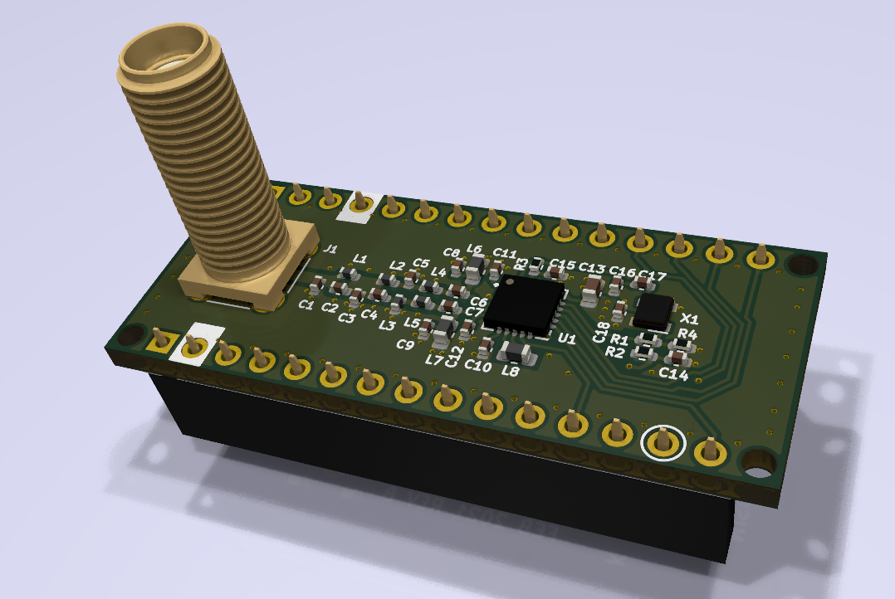

AX5243 Shield for Arduino Nano (3.3V)
=====================================

This is a small test board for AX5243 narrow-band transceiver chip with pinout
compatible with Arduino Nano. Note that the board requires 3.3V supply voltage.

The antenna is matched at 169 MHz. The board is designed using
[KiCad](https://kicad.org), and currently requires a nightly build
(version 5.99). The [schematic](schematic/ax5243-test-board.pdf) is also
available in PDF format. The generated gerber files are available in
[gerbers](gerbers) directory. The board is also available on
[Aisler](https://aisler.net/p/OMGYYSHU).

The produced board was tested using NUCLEO-L432KC development board
and was able to receive and transmit AIS signals. Some test software is
available here: https://github.com/eugmes/ax5243-zephyr

